# 🛡️ Splunk SIEM Project

## 🔍 Introduction

This project demonstrates how to build and operate a fully functional **Security Information and Event Management (SIEM)** solution using **Splunk Enterprise**. The goal is to ingest and analyze logs from multiple sources across a simulated enterprise network in order to detect, alert, and visualize real-world attack patterns.

### 💡 Why Splunk?

Splunk was chosen because of its:

- Powerful log indexing and search capabilities
- Built-in support for dashboards and visualizations
- Extensive support for log sources (via Universal Forwarder, Syslog, HEC, etc.)
- Ability to integrate with threat detection tools like Wazuh and honeypots like Cowrie

---

## 🎯 2. Objectives

- ✅ Perform **centralized log collection** from multiple systems into Splunk
- ✅ Enable **real-time detection** of brute force, reverse shell, and malicious process execution
- ✅ Build **interactive dashboards** to visualize attack trends and traffic patterns
- ✅ **Simulate real-world attacks** in a controlled lab and observe how logs flow and get correlated across systems

---

## 🧰 3. Tools and Technologies

The following tools and technologies were used to build and simulate the Splunk SIEM environment:

### 🔶 SIEM Platform

- **Splunk Enterprise**
  - Version: 9.x
  - Role: Core SIEM platform for log collection, correlation, alerting, and dashboarding

### 🔍 Intrusion Detection

- **Wazuh HIDS**
  - Role: Host-based intrusion detection system (Linux and Windows agents)
  - Features: File integrity monitoring, rootkit detection, real-time alerts

- **Sysmon (System Monitor)**
  - Role: Windows endpoint visibility (process creation, network activity, registry changes)

### 🧪 Honeypot

- **Cowrie**
  - Role: SSH honeypot to simulate vulnerable Linux systems
  - Captures: Brute-force attempts, commands entered by attackers, session transcripts

### 🌐 Network & Firewall

- **OPNsense Firewall**
  - Role: Network router and firewall (based on HardenedBSD)
  - Forwards firewall logs to Splunk via Syslog

### 💻 Operating Systems

| OS                | Used For                         |
|------------------|----------------------------------|
| **Kali Linux**    | Splunk server, attacker machine  |
| **CSI Linux**     | Wazuh Manager, log source        |
| **Windows Server 2008** | Wazuh agent + Sysmon logs      |
| **OPNsense**      | Firewall and log forwarder       |
| **Debian/Kali Minimal** | Cowrie honeypot host            |

### 📦 Log Collection & Transport

- **Splunk Universal Forwarder**
  - Installed on CSI Linux and Windows Server to send logs to Splunk

- **Syslog (UDP)**
  - Used by OPNsense to forward firewall logs to Splunk

- **HTTP Event Collector (HEC)**
  - Used by Cowrie to send JSON logs directly to Splunk

- **File Monitoring**
  - Splunk used to monitor `.evtx`, `.json`, `.xml`, and system log files

### 📊 Visualization & Analysis

- **Splunk Dashboards**
  - Custom dashboards for Cowrie, Wazuh, Sysmon, and firewall traffic

- **Splunk Search Processing Language (SPL)**
  - For querying and alerting based on log data

---

## 🔄 4. Log Sources and Integration

This section outlines the various log sources integrated into Splunk and how each was configured and ingested.

---

### ✅ Wazuh Agent + Splunk

- **Transport Method:** Splunk Universal Forwarder or Wazuh REST API
- **Index:** `wazuh`
- **Sourcetype:** `json:wazuh` (via Wazuh app for Splunk)
- **Logs Collected:**
  - File integrity monitoring
  - Unauthorized access attempts
  - Process creation (via Sysmon)
  - User logins and privilege escalations

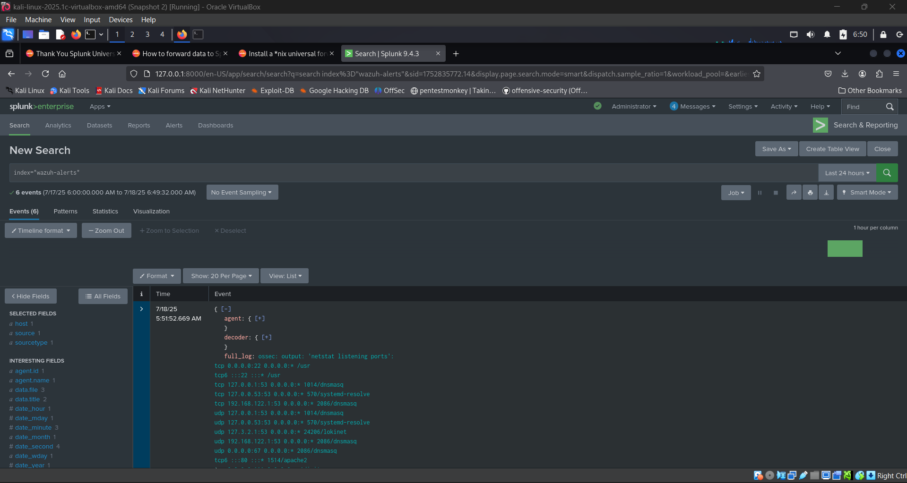

---

### ✅ Cowrie Honeypot Logs

- **Transport Method:** HTTP Event Collector (HEC)
- **Index:** `honeypot`
- **Sourcetype:** `cowrie`
- **Logs Collected:**
  - SSH brute-force attempts
  - Successful logins
  - Commands issued by attackers
  - TTY session replays

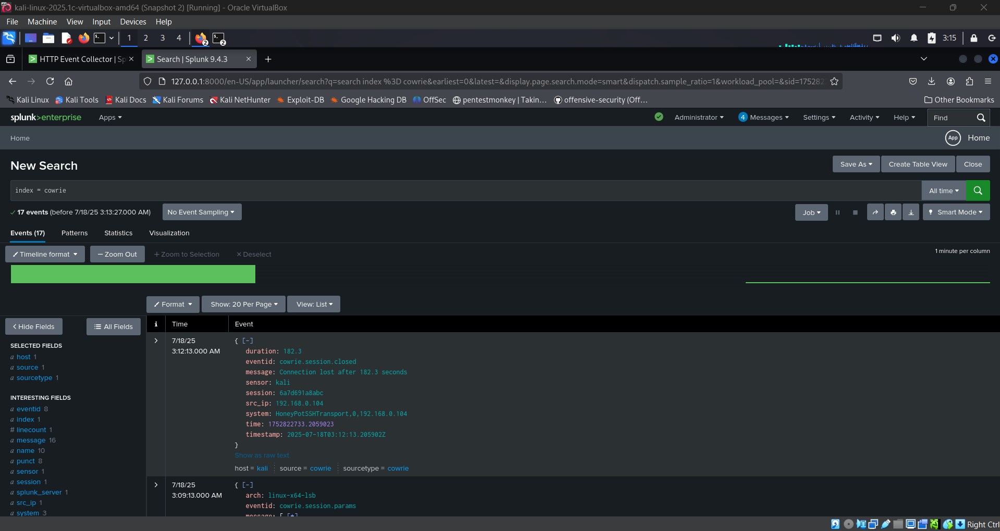

---

### ✅ OPNsense Firewall Logs

- **Transport Method:** UDP Syslog (`port 514`)
- **Index:** `opnsense`
- **Sourcetype:** `syslog` (with optional `TA-pfSense`)
- **Logs Collected:**
  - Blocked/allowed firewall events
  - NAT and port-forward rules
  - Interface traffic stats

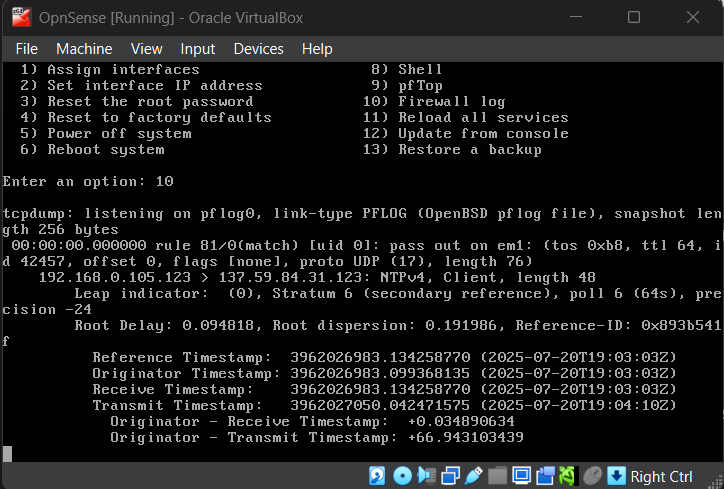

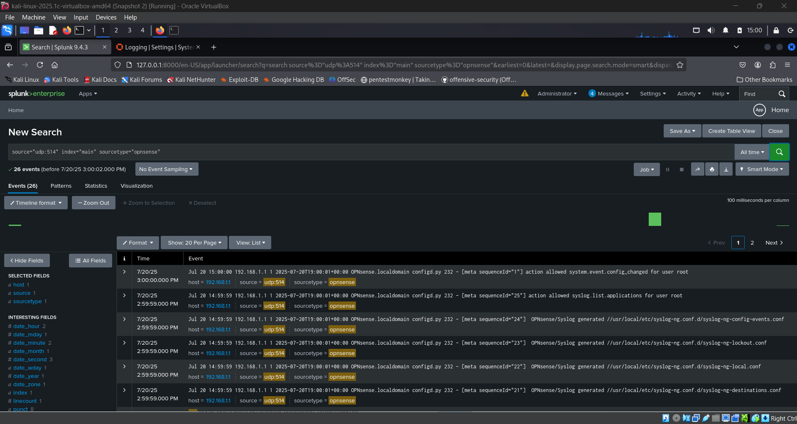

---

### ✅ Local Linux Logs

- **Transport Method:** File Monitor Input
- **Index:** `linux`
- **Sourcetype:** `linux:syslog`
- **Logs Collected:**
  - `/var/log/auth.log`, `/var/log/syslog`
  - `sudo`, `ssh`, `cron`, journald events

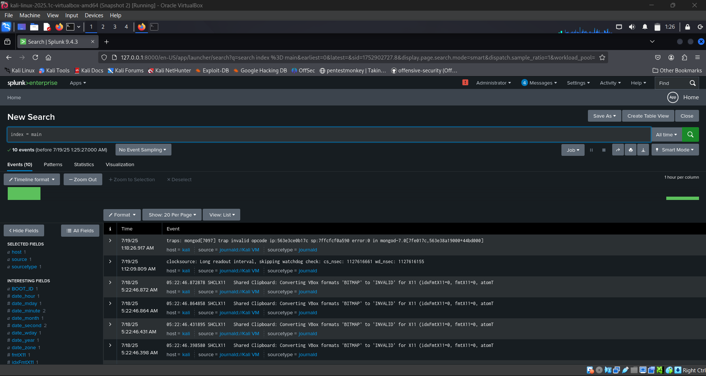

---

## 🔍 5. Search Queries and Use Cases

Below are examples of SPL (Search Processing Language) queries used for threat detection and log analysis. 

---

### 🔐 1. SSH Brute Force Detection (Cowrie)

```spl
index=honeypot sourcetype=cowrie eventid="cowrie.login.failed"
| stats count by src_ip, username
| where count > 10
```

#### 🧠 Breakdown

| Part of Query                        | Meaning                                                                 |
|--------------------------------------|-------------------------------------------------------------------------|
| `index=cowrie`                     | Searches only in the `cowrie` index where Cowrie logs are stored     |
| `sourcetype=cowrie`                  | Filters results to only logs tagged with the Cowrie sourcetype         |
| `eventid="cowrie.login.failed"`      | Matches only failed login attempts to the honeypot                      |
| `stats count by src_ip, username`    | Aggregates number of failed attempts for each IP and username combo    |
| `where count > 10`                   | Shows only attackers with more than 10 failed attempts (brute force)   |

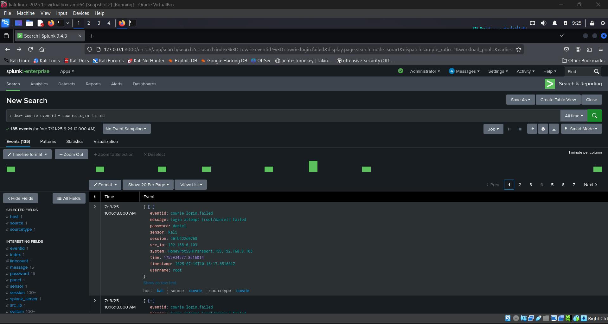

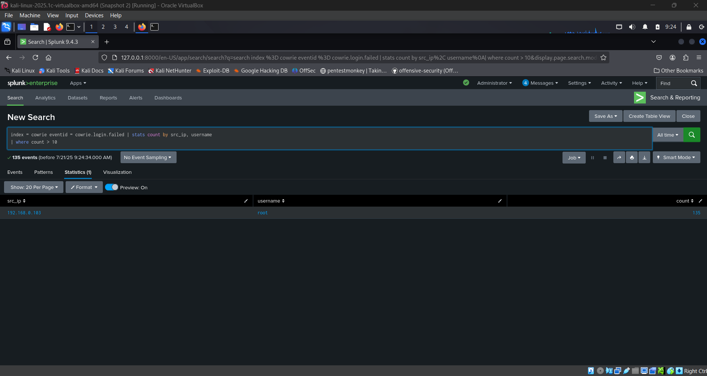


###  ✅ 2. Successful Honeypot Login

```spl
index=cowrie sourcetype=cowrie eventid="cowrie.login.success"
| stats count by src_ip, username
```

#### 🧠 Breakdown

| Part of Query                        | Meaning                                                                 |
|--------------------------------------|-------------------------------------------------------------------------|
| `index=cowrie`                     | Searches only in the `cowrie` index where Cowrie logs are stored     |
| `sourcetype=cowrie`                  | Filters results to only logs tagged with the Cowrie sourcetype         |
| `eventid="cowrie.login.success"`      | Matches only failed login attempts to the honeypot                      |
| `stats count by src_ip, username`    | Aggregates number of failed attempts for each IP and username combo    |


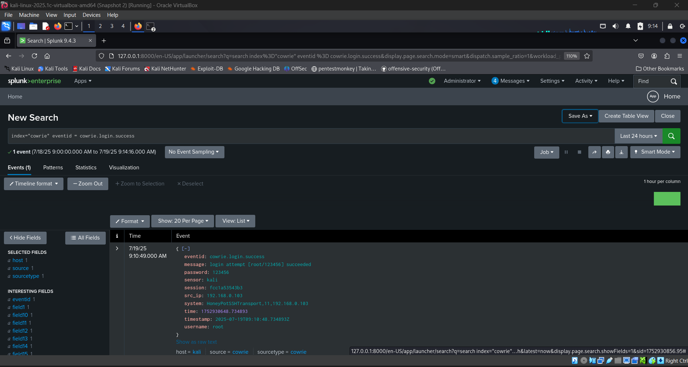


### 🧠 3. Enhanced Time-Based Port Scan Detection

```spl
index=cowrie sourcetype=cowrie
| bucket _time span=1m
| stats dc(dest_port) as port_count by _time, src_ip
| where port_count > 20
| sort - _time
```

#### 🧠 Breakdown

| Part of Query                        | Meaning                                                                 |
|--------------------------------------|-------------------------------------------------------------------------|
| `bucket _time span=1m`                     | Groups events into 1-minute time buckets     |
| `dc(dest_port) as port_count`              | Counts unique destination ports accessed per minute         |
| `by _time, src_ip`           | Groups counts by timestamp and source IP                 |
| `where port_count > 20`       | Filters IPs scanning more than 20 ports in 1 minute (likely Nmap)    |
| `sort - _time	`              | Sorts results by latest time |


### 🧨 4. Reverse Shell Command Detection (Windows Logs)

```spl
index=main sourcetype=_json event.module="sysmon" event.action="ProcessCreate"
| search process_path=*cmd.exe* OR process_path=*powershell.exe* OR process_path=*nc.exe*
| table _time user process_path parent_process command_line
| sort - _time

```

#### 🧠 Breakdown

| Part of Query                                               | Meaning                                                           |
| ----------------------------------------------------------- | ----------------------------------------------------------------- |
| `index=main`                                                | Searches logs in main |
| `sourcetype=_json`                                          | Filters only in JSON format                                       |
| `event.module="sysmon"` `event.action="ProcessCreate"`      | Limits to process creation events from Sysmon                     |
| `process_path=*cmd.exe* OR powershell.exe OR nc.exe`        | Detects suspicious processes commonly used in reverse shells      |
| `table _time user process_path parent_process command_line` | Displays relevant process details for triage                      |
| `sort - _time`                                              | Shows most recent entries first                                   |


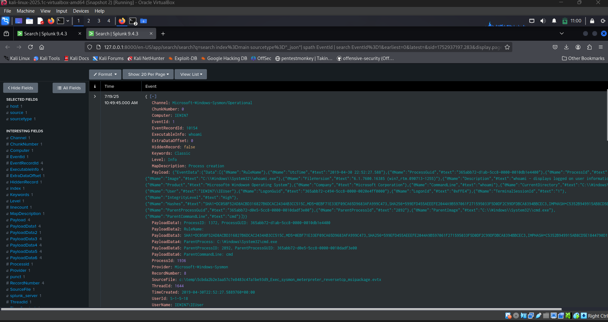

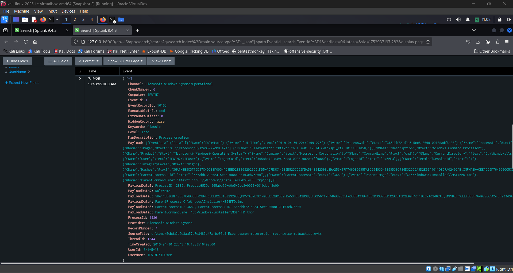

### 🔐 5. Passwords used in Brute Force

```spl
index=cowrie sourcetype=cowrie eventid="cowrie.login.failed"
| table eventid, username, password
```

#### 🧠 Breakdown

| Part                            | Description                                                                                                                      |               
| ------------------------------- | -------------------------------------------------------------------------------------------------------------------------------- | 
| `index=cowrie`                  | Limits the search to the `cowrie` index, where logs from the Cowrie honeypot are stored.                                         |                                                                                                                                                 
| `sourcetype=cowrie`             | Filters the data to only those events tagged with the `cowrie` sourcetype (ensures you're only looking at Cowrie-specific logs). |                                                                                                                                                 
| `eventid="cowrie.login.failed"` | Matches only events where a **login attempt failed** — typically during brute-force attacks.                                     |                                                                                                                                                 
| `table eventid, username, password`  |   Formats the output into a table showing:<br>• `eventid` (the event type)<br>• `username` used in the attempt<br>• `password` the attacker tried |

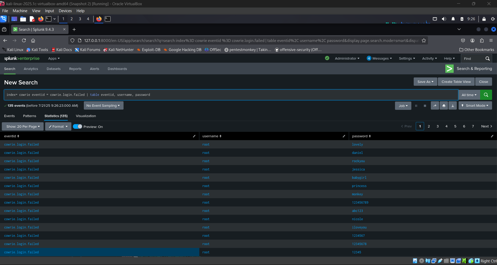

---

## 🚨 6. Alerts Creation in Splunk

Alerts in Splunk are based on saved searches that are **scheduled to run periodically**. When the result of the search meets a specific condition, Splunk triggers a defined **action**, such as sending an email, executing a script, or writing to a log.

---

### 🧭 Steps to Create an Alert

1. **Go to:** `Search & Reporting` app
2. **Run a search** you want to alert on (e.g., successful Cowrie logins)
3. **Click "Save As → Alert"**
4. Fill in the following:

| Field | Description |
|-------|-------------|
| **Title** | Name of the alert (e.g., `Honeypot Successful Login`) |
| **Time range** | How far back Splunk should look (e.g., last 5 minutes) |
| **Trigger condition** | When to trigger (e.g., if result count > 0) |
| **Trigger actions** | Email, log event, webhook, script, etc. |
| **Schedule** | How often to run (e.g., every 5 minutes) |

---

### ✅ Example Alert: Honeypot Successful Login

### 🔍 Alert Search Query

```spl
index=honeypot sourcetype=cowrie eventid="cowrie.login.success"
| stats count by src_ip, username
```

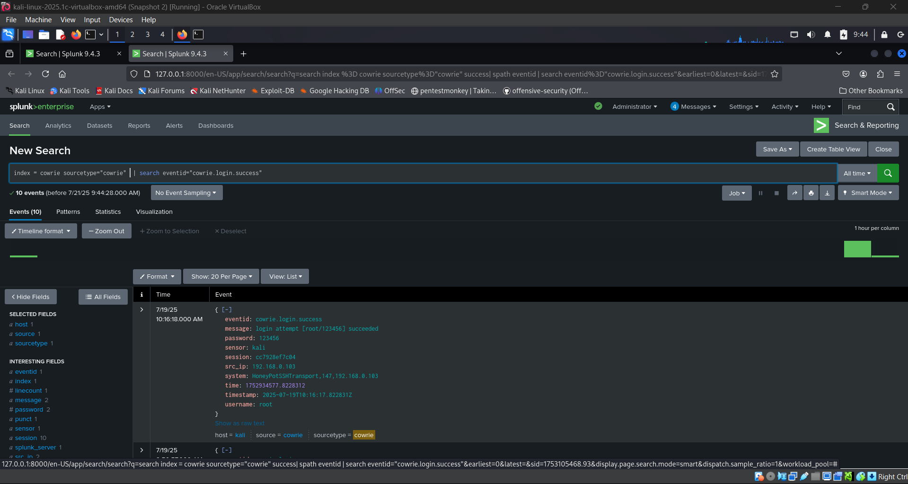


| Field                 | Value                                                           |
| --------------------- | --------------------------------------------------------------- |
| **Alert Name**        | Honeypot Successful Login                                       |
| **Schedule**          | Every 5 minutes                                                 |
| **Search Window**     | Last 5 minutes                                                  |
| **Trigger Condition** | If results **exist** (i.e., count > 0)                          |
| **Action**            | Send email to [analyst@example.com](mailto:analyst@example.com) |

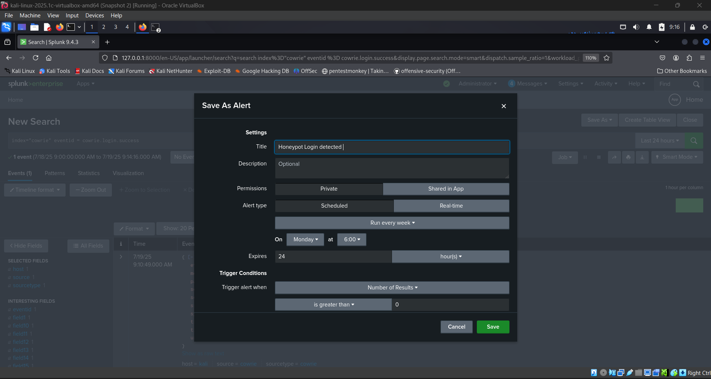

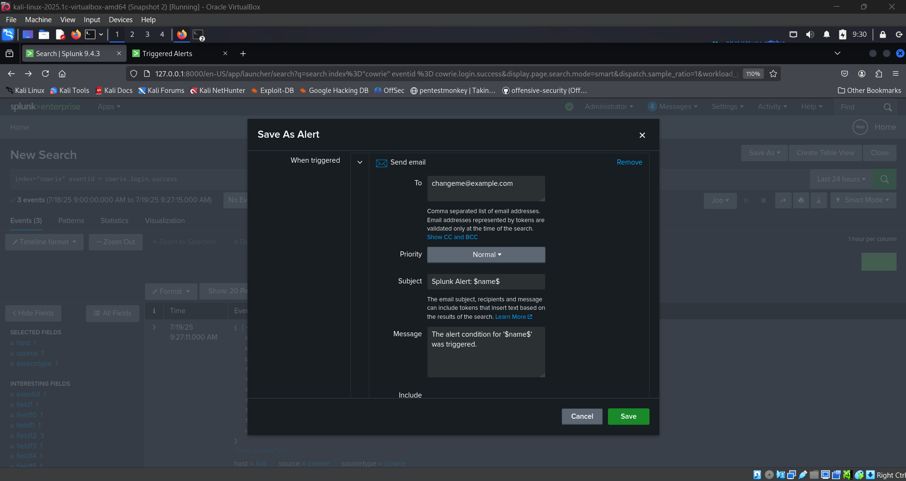


### ✅ How to Check If an Alert Was Triggered in Splunk

Splunk provides multiple ways to verify whether an alert has been triggered, depending on how it was configured (real-time vs. scheduled, output actions, etc.).

---

### 1. 🔔 Use the Alerts Dashboard (Splunk Web)

**Steps:**
1. Navigate to the `Search & Reporting` app.
2. Click on **Alerts** in the top navigation bar.

**You’ll see a list of:**
- Alert Name
- Triggered Time
- Trigger Count
- Last Triggered Result
- Status (Enabled/Disabled)

💡 *Click on an alert name to view its detailed configuration and trigger history.*

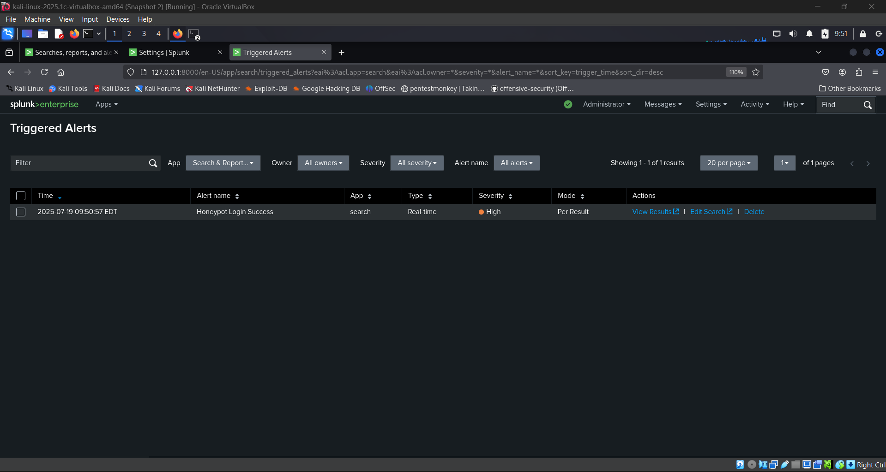

---

### 2. 📦 Check the Alert Actions (Email, Index Logging, Webhook)

#### 📝 Example: Logging to an Index

If your alert was configured to write to an index:

```spl
index=alerts sourcetype=cowrie_alerts
```

This helps verify if the alert was logged internally.

#### ✉️ Example: Email Notification

If the alert was set to send an email:
Check your inbox or SMTP mail logs.
Ensure email settings in Splunk are configured correctly under Settings → Server Settings → Email settings.

---

### 3. 🕵️‍♂️ Search Splunk’s Internal Logs
   
Splunk records alert executions in the internal scheduler logs.

```spl
index=_internal source=*scheduler.log* savedsearch_name="Honeypot Successful Login"
| table _time savedsearch_name status user
| sort - _time
```

| Field              | Description                                   |
| ------------------ | --------------------------------------------- |
| `savedsearch_name` | Name of the alert                             |
| `status`           | Execution result (`success`, `skipped`, etc.) |
| `_time`            | When the alert was triggered                  |
| `user`             | User who owns the saved search                |

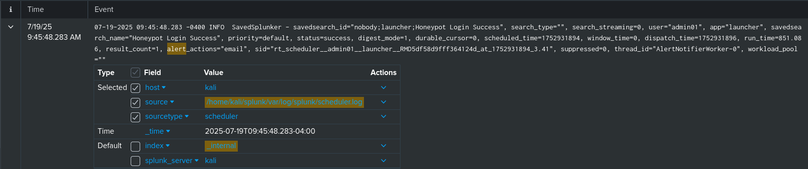


#### 🛠️ Troubleshooting Tips
| ✅ Checklist                | Description                                                        |
| -------------------------- | ------------------------------------------------------------------ |
| Alert is Enabled           | Make sure it’s not disabled                                        |
| Schedule is Valid          | Check that the schedule matches expected time windows              |
| Trigger Conditions Are Met | Ensure thresholds are realistic (e.g., `count > 0`)                |
| Throttling Settings        | Verify if throttling is delaying repeated alerts                   |
| User Permissions           | Alert owner must have permission to access the relevant index/data |

---

##  📊 7. Dashboards in Splunk

Dashboards in Splunk are used to visualize search results through tables, graphs, and charts. They provide a centralized view for monitoring threat activity, system health, or specific log sources.

---

### 1. 🧭 Viewing Dashboards in Splunk Web

**Steps:**

1. Navigate to the `Search & Reporting` app.
2. In the top navigation bar, click on `Dashboards`.
3. You will see a list of saved dashboards:
   - Dashboard title
   - Creator/owner
   - Last updated date
   - Permissions (Private / Shared)

🔍 *Click on any dashboard title to open and explore panels.*

---

### 2. 🛠️ Creating a New Dashboard

**Steps:**

1. Go to `Dashboards` → Click **Create New Dashboard**.
2. Enter:
   - **Title**: e.g., `Honeypot SSH Activity`
   - **ID**: Auto-generated or custom
   - **Permissions**: Private or shared (recommended)
3. Click **Create Dashboard**.

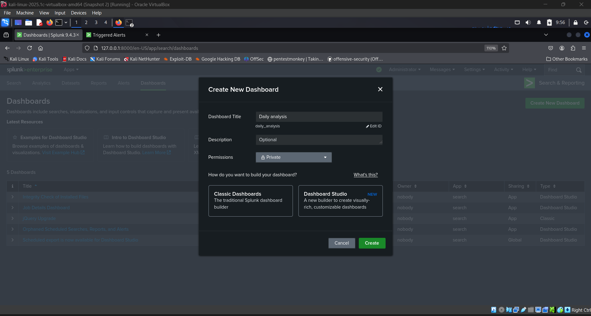

---

### 3. ➕ Adding Panels to a Dashboard

**Steps:**

1. Open the desired dashboard → Click **Edit**.
2. Click **Add Panel** → Choose from:
   - **New from Search**: Run a fresh search
   - **From a Report**: Use a saved search/report
3. Customize:
   - Title
   - Visualization type (table, chart, pie, etc.)
   - Description

🧠 *Use `Time Range Picker` inputs to make your dashboards more interactive.*

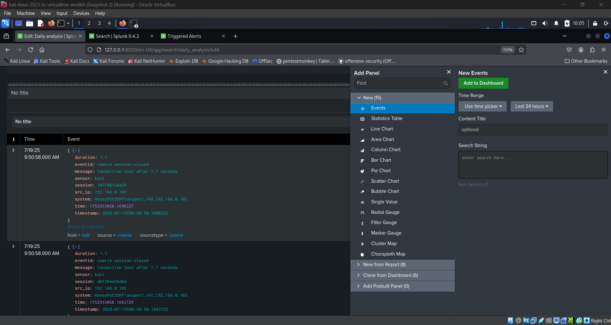

---

### 📊 Example Dashboard: Brute Force Detection

This dashboard helps monitor and visualize brute force login attempts, especially on SSH honeypots like Cowrie.

---

#### 🛠️ Step-by-Step: Creating the Dashboard

1. Go to the **Search & Reporting** app in Splunk Web.
2. Click on **Dashboards → Create New Dashboard**.
3. Fill in:
   - **Title**: `Brute Force Detection Dashboard`
   - **ID**: `brute_force_dashboard`
   - **Permissions**: Private or Shared
4. Click **Create Dashboard**.
5. Now click **Add Panel → New from Search** and use the queries below.

---

#### 📊 Panel : Brute Force attempts overtime

```spl
index=cowrie sourcetype=cowrie eventid="cowrie.login.failed" eventid="cowrie.login.success"
| stats count by src_ip
```

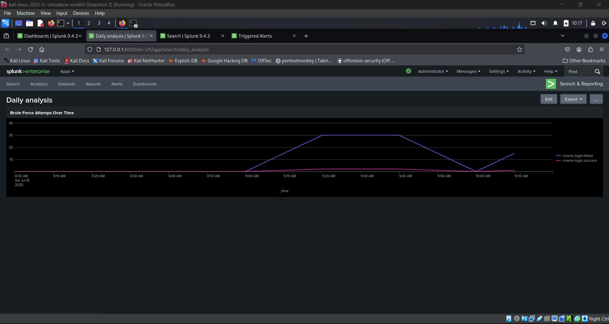

---

## 📈 8. Findings & Analysis

This section summarizes the key observations made during the project through log analysis.

### 1. Windows Sysmon Process Creation Log

This log was ingested from a Windows Server running Sysmon and shows a reverse shell attack attempt using cmd.exe.


| Field                 | Value                                                | Explanation                                                             |
| --------------------- | ---------------------------------------------------- | ----------------------------------------------------------------------- |
| **Channel**           | `Microsoft-Windows-Sysmon/Operational`               | Indicates the log comes from Sysmon service.                            |
| **EventID**           | `1`                                                  | Event ID 1 in Sysmon = **process creation**.                            |
| **ExecutableInfo**    | `cmd`                                                | A command prompt was launched. Possible indicator of an attacker shell. |
| **Image**             | `C:\\Windows\\System32\\cmd.exe`                     | The actual binary executed.                                             |
| **ParentCommandLine** | `C:\\Windows\\Installer\\WSI4FFD.tmp`                | Suspicious parent file; may be malware dropping a shell.                |
| **RuleName**          | `Exec_sysmon_meterpreter_reversetcp_msipackage.evtx` | Indicates the test file simulating Meterpreter reverse shell.           |

🔍 Security Insight: A reverse shell was successfully initiated via a fake MSI installer. The attack was captured using Sysmon and analyzed using Splunk.

### 2. Local Linux Journald Logs

This screenshot contains system-level logs collected from Kali Linux using the journald sourcetype.


| Field          | Value                | Explanation                              |
| -------------- | -------------------- | ---------------------------------------- |
| **index**      | `main`               | Default index used to store events.      |
| **sourcetype** | `journald`           | Indicates logs from the systemd journal. |
| **host**       | `kali`               | Name of the local system.                |
| **source**     | `journald://Kali VM` | Origin of the logs.                      |

🧾 Sample Events:

Shared Clipboard: Converting VBox formats... — VirtualBox clipboard messages.
mongod[7097] trap invalid opcode — MongoDB service error.

🔍 Security Insight: Though not malicious, these logs establish normal behavior and can assist in spotting anomalies later.

### 3. OPNsense Syslog Logs (UDP 514)

This log stream originates from an OPNsense firewall, forwarded via Syslog on port UDP 514.


| Field               | Value         | Explanation                                     |
| ------------------- | ------------- | ----------------------------------------------- |
| **source**          | `udp:514`     | Indicates logs received over UDP.               |
| **sourcetype**      | `opnsense`    | Parsed using `TA-pfSense` or equivalent add-on. |
| **host**            | `192.168.1.1` | IP of the OPNsense router.                      |
| **Meta sequenceId** | e.g., `"24"`  | Unique event identifier from OPNsense.          |

🧾 Sample Logs:

action allowed system.event.config_changed for user root
syslog.list.applications for user root

🔍 Security Insight: Tracks configuration changes and system activity on the firewall — critical for auditing.

### 4. Cowrie Honeypot Log (via HTTP Event Collector)

This log was generated when an attacker attempted to connect to the Cowrie SSH Honeypot on a non-standard port (2222).

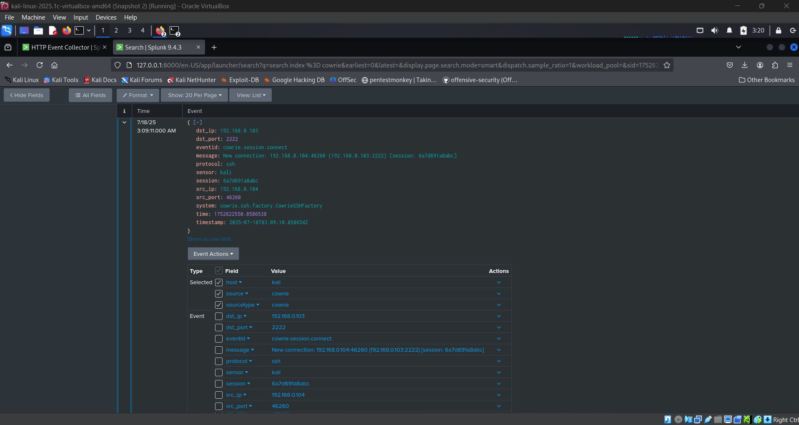

| Field         | Value                                 | Explanation                                |
| ------------- | ------------------------------------- | ------------------------------------------ |
| **eventid**   | `cowrie.session.connect`              | New SSH connection to Cowrie detected.     |
| **src\_ip**   | `192.168.0.104`                       | Attacker's IP address.                     |
| **dst\_ip**   | `192.168.0.103`                       | Honeypot IP address.                       |
| **dst\_port** | `2222`                                | Custom SSH port used by Cowrie.            |
| **system**    | `cowrie.ssh.factory.CowrieSSHFactory` | Cowrie’s backend handler for SSH sessions. |
| **sensor**    | `kali`                                | Name of system running Cowrie.             |

🔍 Security Insight: This log confirms a brute-force or probing attempt against the honeypot. Can be correlated with failed logins or command execution.

### 5. Wazuh Alert Log from Splunk

This Wazuh log shows open ports reported via OSSEC module, parsed into Splunk.


| Field       | Value          | Explanation                                             |
| ----------- | -------------- | ------------------------------------------------------- |
| **index**   | `wazuh-alerts` | Alerts from Wazuh are sent to this index.               |
| **agent**   | `windows/kali` | The machine where the alert originated.                 |
| **decoder** | `netstat`      | Indicates the log parsed by `netstat` decoder in Wazuh. |

🔍 Security Insight: Helps identify services running on critical ports. Can detect new/hidden services indicating backdoors or post-exploitation behavior.

---

Certainly! Below is the **"Key Learnings"** section in clean **GitHub-flavored Markdown** format for your `report.md`:

---

Here is how you can write the final sections of your `report.md` for your **Splunk SIEM Project** in proper **GitHub Markdown format**:

---

## 🧱 9. Challenges Faced

During the setup and integration of multiple components into Splunk, several issues were encountered:

### ⚠️ Configuration Issues

* ❌ **Splunk Universal Forwarder Authentication**: Troubles occurred with token mismatch while forwarding Wazuh data.
* ❌ **Cowrie to Splunk (HEC)**: The HEC port had to be manually enabled and configured in Splunk, and SSL verification sometimes blocked test events.

### 📦 Data Volume Management

* 🌀 Splunk generated a high volume of logs, especially from journald and Wazuh.
* 🧹 Needed to tune inputs and limit noisy log sources to keep Splunk responsive.

### ⚙️ Field Extraction & Parsing

* 🛠️ Some logs (e.g., OPNsense) needed extra parsing using add-ons like **TA-pfSense**.
* 🛠️ Manual field extractions were required in a few JSON-based test files for meaningful dashboards.

---

## 🧠 10. Key Learnings

Throughout this project, several technical and analytical skills were developed and reinforced:

### 🔍 Log Ingestion and Parsing

* Gained hands-on experience ingesting logs from heterogeneous sources (Linux, Windows, Honeypot, Firewall).
* Learned to assign appropriate `sourcetypes`, indexes, and parsing configurations in Splunk.
* Understood the importance of clean field extractions for accurate searching and correlation.

### ⚙️ Data Integration

* Successfully set up:

  * **Splunk Universal Forwarder** for agent-based log forwarding (Wazuh, journald).
  * **HTTP Event Collector (HEC)** for forwarding Cowrie honeypot logs.
  * **Syslog over UDP** to receive firewall logs from OPNsense.
* Integrated all logs into Splunk in near real-time for central visibility.

### 📈 Security Event Analysis

* Practiced writing **SPL (Search Processing Language)** queries to identify:

  * Brute-force attempts on SSH.
  * Reverse shell execution.
  * Port scan activity.
* Analyzed attack timelines using indexed event data across multiple sources.

### 🚨 Alerting and Automation

* Created **real-time and scheduled alerts** to notify about security events.
* Configured alert actions:

  * Email notifications
  * Dashboard card triggers
  * Logging to custom index

### 📊 Dashboarding and Visualization

* Built dashboards to visualize: Honeypot SSH activity
* Created correlation views showing attacker activity across systems.

### 🧩 Performance and Optimization

* Understood the impact of **high-volume logging** on Splunk performance.
* Applied:

  * Source filtering
  * Event sampling
  * Index segregation (e.g., `honeypot`, `wazuh`, `opnsense`)
* Tuned Splunk input configurations to maintain efficiency.

---

## ✅ 11. Conclusion

This project successfully demonstrated a practical implementation of a **Security Information and Event Management (SIEM)** system using **Splunk**. Multiple data sources were integrated, including:

* Wazuh HIDS alerts from Windows and Linux
* Cowrie SSH honeypot logs
* OPNsense firewall syslogs
* Journald system logs

The environment allowed for:

* Simulating **real-world attacks** such as brute-force, reverse shells, and port scans
* Creating **correlated alerts** and **actionable dashboards**
* Performing **event correlation** across multiple layers (host, firewall, honeypot)

Splunk proved to be a powerful platform for security analysis when paired with structured log forwarding, proper field extractions, and thoughtful use cases.

---

## 📚 12. References

* 📖 [Splunk Documentation](https://docs.splunk.com)
* 📖 [Wazuh Documentation](https://documentation.wazuh.com/)
* 📖 [Cowrie GitHub](https://github.com/cowrie/cowrie)
* 📖 [OPNsense Documentation](https://docs.opnsense.org/)
* 💡 Custom rules, alerts, and queries used during the project (included in this repository)

---
