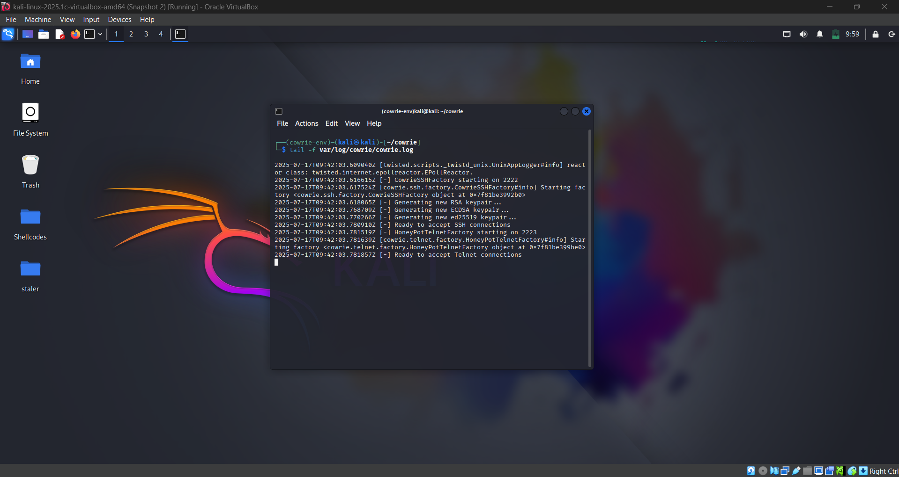
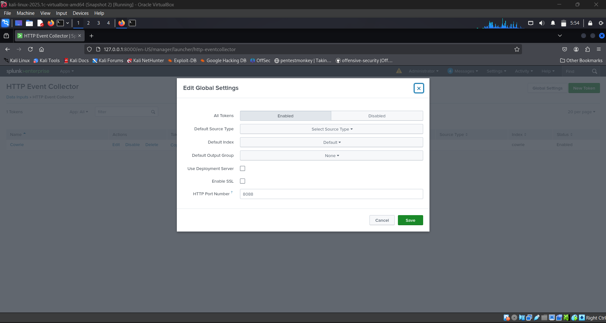
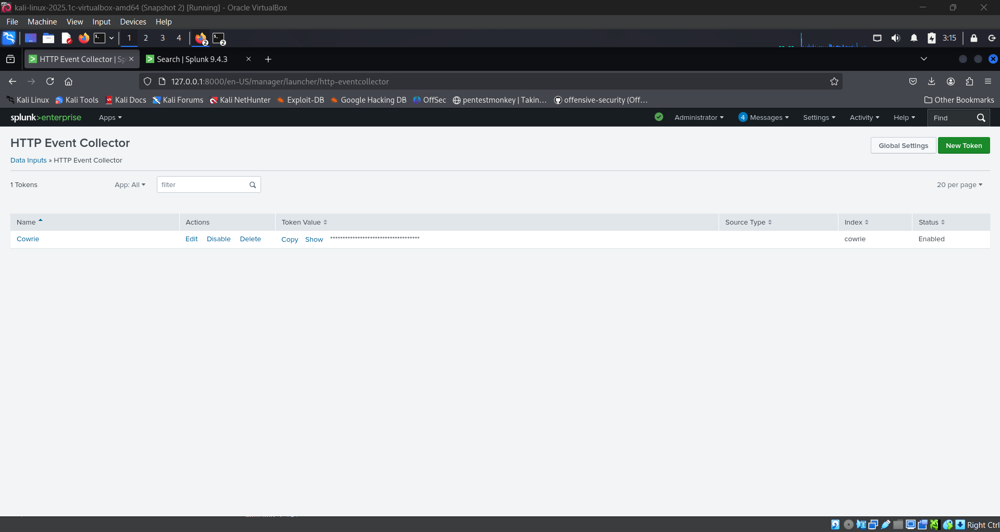
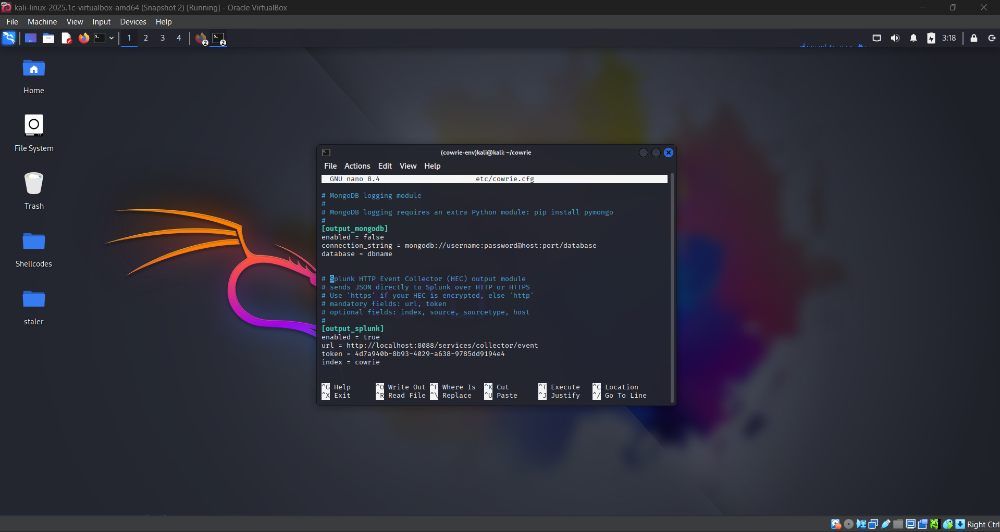

# 🐍 Cowrie Honeypot Log Integration with Splunk

This document outlines how Cowrie honeypot logs were ingested into Splunk for real-time monitoring and analysis. 

---

## 🧰 Environment Details

- Honeypot: Cowrie
- OS: Kali Linux (same machine as Splunk)
- Log Path: `/opt/cowrie/var/log/cowrie/cowrie.json`
- Ingestion Method: File monitoring using the built-in output_splunk module.

---

## ⚙️ Step-by-Step Setup

### 1. Ensure Cowrie is Running and Logging

Verify Cowrie is active and writing to `cowrie.json`:

```bash
tail -f /opt/cowrie/var/log/cowrie/cowrie.json
```



---

### 2. Enable HTTP Event Collector (HEC) in Splunk

- Navigate to: Settings > Data Inputs
- Click on HTTP Event Collector
- Click on Global Settings (top right)
- Set: All tokens: Enabled
- HTTP Port Number: 8088 (default)
- Turn off ssl if not using https
- Click Save



---

### 3. Create a New HEC Token

- Go back to HTTP Event Collector screen
- Click New Token
- Fill in: Name:
   - Cowrie HEC
   - Source type: cowrie
   - Index: cowrie (create it first if it doesn’t exist)
- Click Next
- On the input settings page: Leave default options selected --> Click Review then Submit --> Copy the Token Value and save it securely.



---

### 4. 📦 Enable Splunk Output in Cowrie

- Edit Cowrie Output Configuration File

```bash
sudo nano /opt/cowrie/etc/cowrie.cfg
```

- Enable and Configure Splunk Output Module: Add or modify the following section:

```
[output_splunk]
enabled = true
url = http://<splunk_ip>:8088/services/collector/event
token = <your_splunk_hec_token>
sourcetype = cowrie
index = cowrie
```



---

### 5. Restart Cowrie

```bash
sudo systemctl restart cowrie
```
