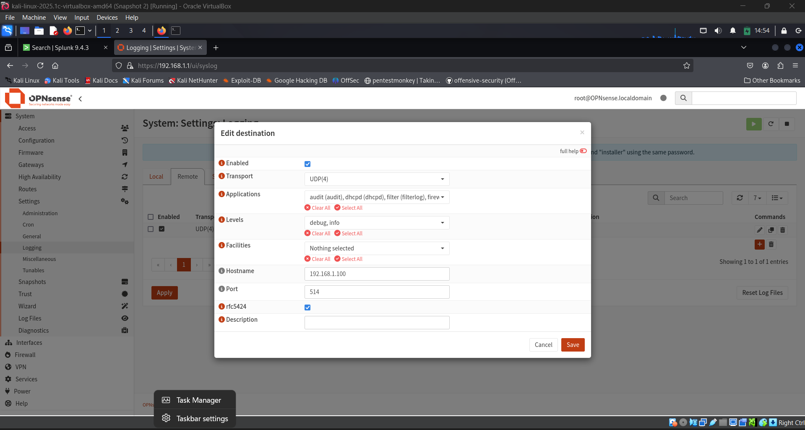
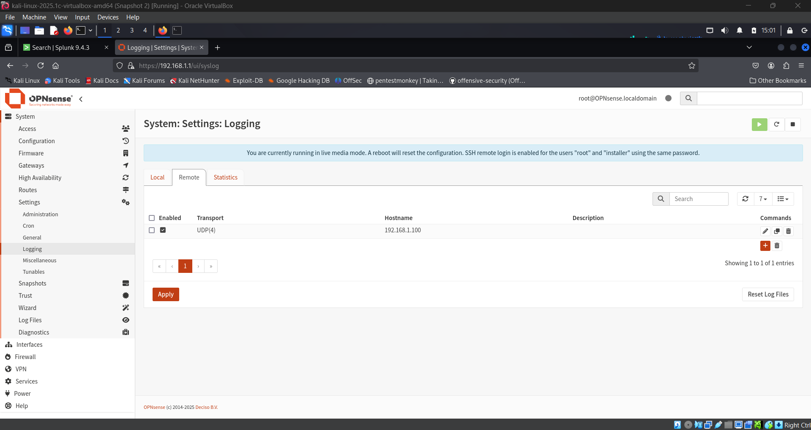
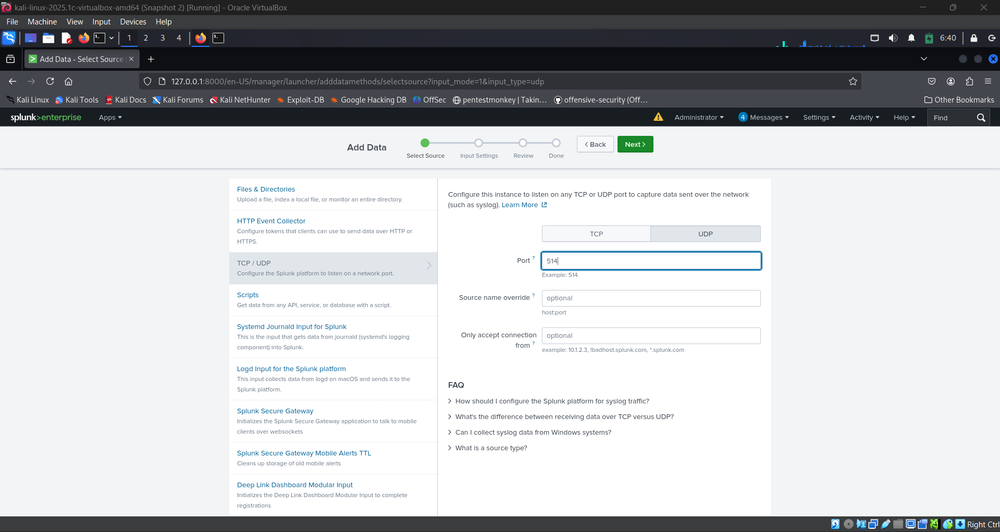
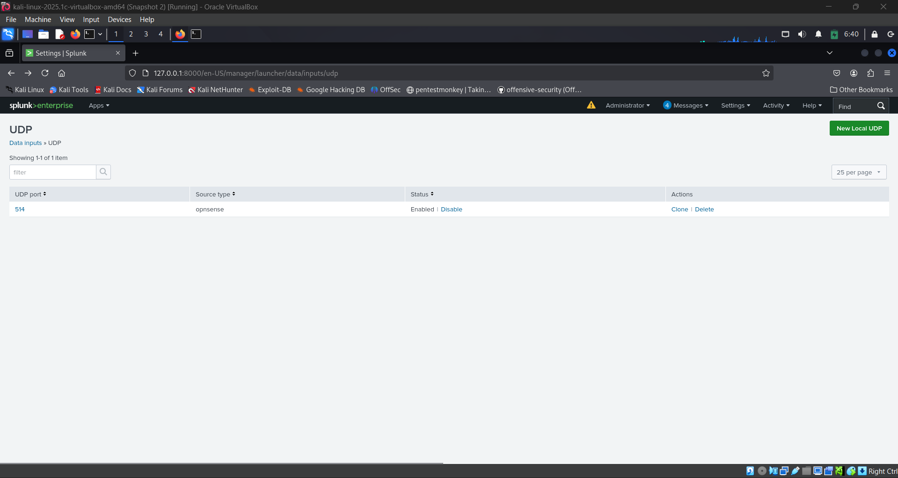

# 🚀 Sending OPNsense Logs to Splunk

To transfer logs from OPNsense to Splunk, you can use the built-in Syslog functionality in OPNsense and receive the logs in Splunk using either a TCP/UDP input or via a Splunk Universal Forwarder on another system.

### 🛠️ Step 1: Enable Remote Syslog in OPNsense

1. Log in to the **OPNsense Web UI**.
2. Go to:  
   `System → Settings → Logging / targets`
3. Click **➕ Add** to create a new log target.
4. Fill in the following fields:

   | Field        | Value                                                    |
   |--------------|----------------------------------------------------------|
   | **Target**   | IP address of the Splunk server (e.g., `192.168.1.100`)  |
   | **Transport**| `UDP` or `TCP` (UDP is commonly used)                    |
   | **Port**     | `514` (default syslog port)                              |
   | **Facility** | `Local0` (or any other facility you prefer)              |
   | **Level**    | `Informational` or `Debug` (for more verbosity)          |

- ⚠️ **Note:** The "Format" field (e.g., `BSD Syslog` or `RFC 5424`) may not appear in newer OPNsense versions. OPNsense defaults to **BSD Syslog**, which is compatible with Splunk.

5. ✅ Check the box to **enable** the target.
6. Click **Save**, then **Apply Changes**.

---

### 📥 Step 2: Configure Splunk to Receive Syslog Data

#### ✅ Use a UDP Listener in Splunk

1. Open the **Splunk Web UI**.
2. Navigate to:  
   `Settings → Data Inputs → UDP → Add new`

   
4. Fill in the fields as follows:

   | Field           | Value                            |
   |------------------|----------------------------------|
   | **Port**         | `514`                            |
   | **Source type**  | `syslog` or `opnsense:syslog`    |
   | **Index**        | `main` or a custom index like `opnsense` |
   | **Host**         | `Automatic` or custom            |

5. Click **Save**.

- ✅ Make sure **port 514** is open and not blocked by your firewall.

---

### 📝 Optional Tips

- Consider creating a **dedicated index** like `opnsense` for better log separation.
- Use the official [**TA-pfSense Add-on**](https://splunkbase.splunk.com/app/3796/) from Splunkbase to:
  - Improve field extractions
  - Enable CIM compliance
  - Build dashboards easily
- For more secure logging, use **TCP** or **TLS** if available in future updates.

---
