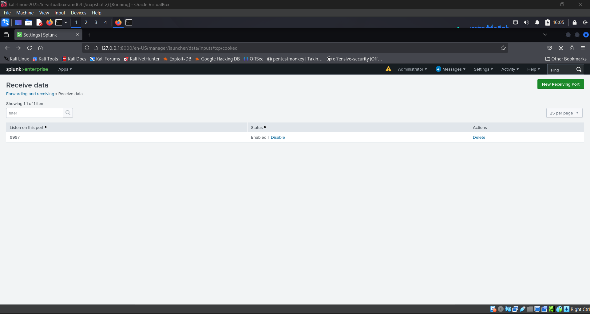
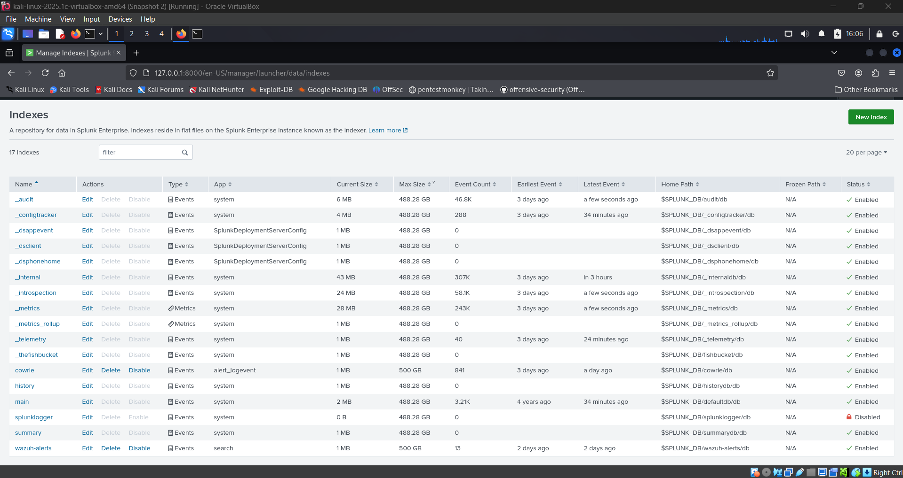
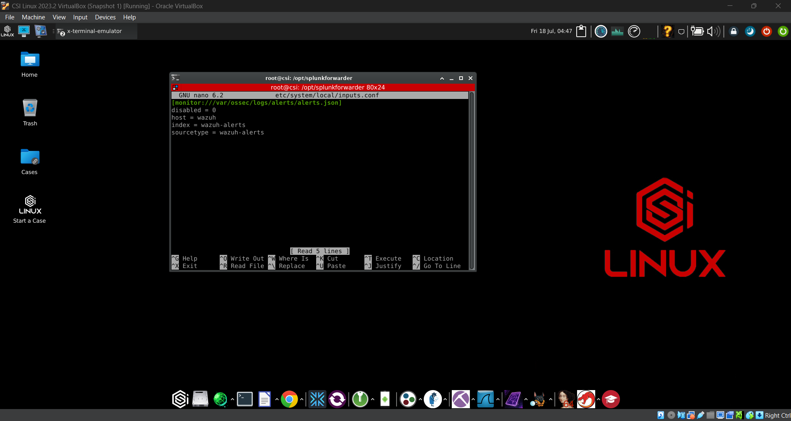
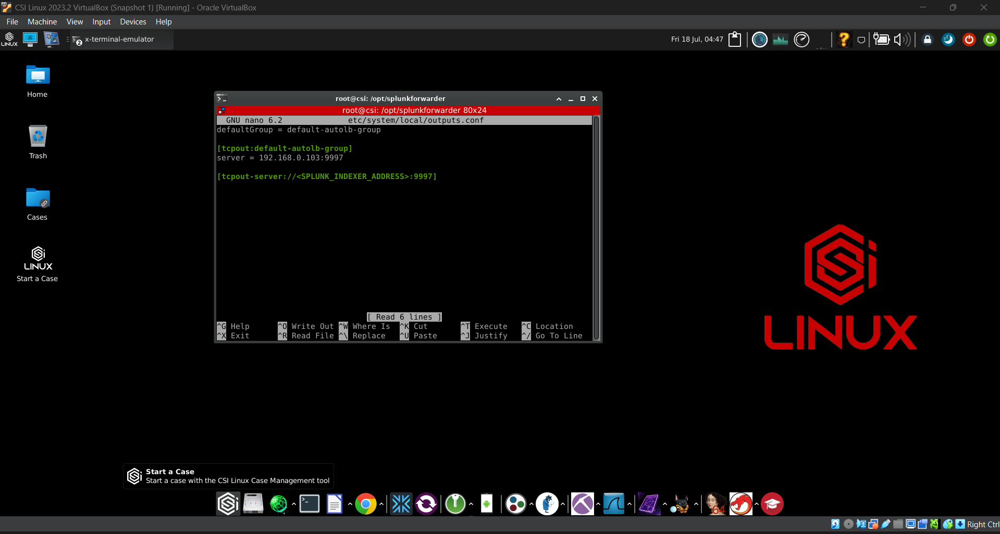
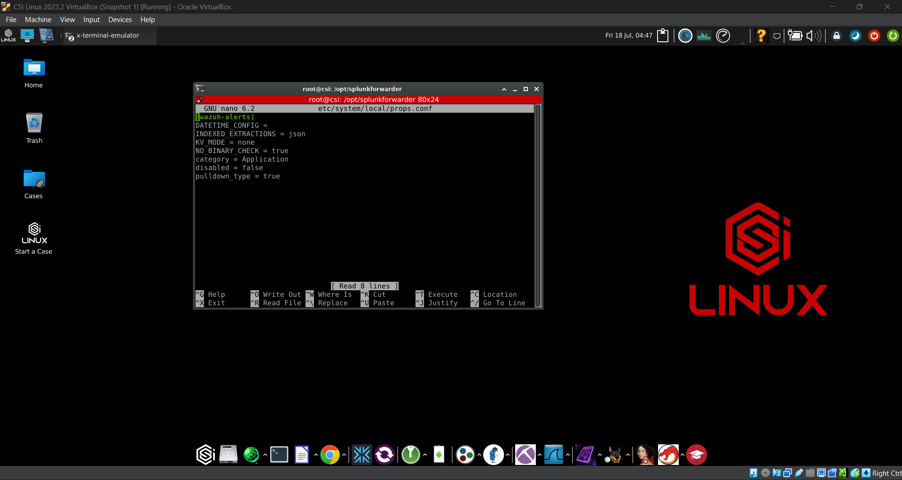
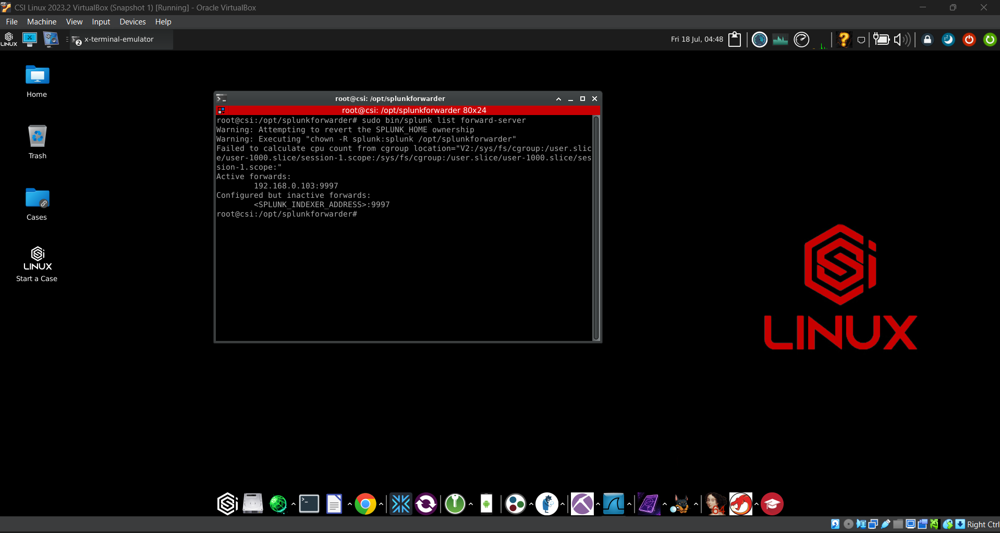

# 🔐 Wazuh Integration with Splunk via Universal Forwarder

This document explains how logs were forwarded from the Wazuh server (running on CSI Linux) to Splunk Enterprise using the Splunk Universal Forwarder (UF).

---

## ⚙️ Step-by-Step Setup

### 1. Splunk Indexer configuration

Splunk Indexer needs to be setup to receive logs before installing and configuring universal forwader on wazuh host. To configure the indexer you need to set a receiving port and create a index.

#### Configuring Receiving Port

- Go to Settings > Forwarding and receiving.

- Under Receive data, click Add new.

- Enter `9997` in the Listen on this port input box and click Save.




#### Configuring Indexer

- Go to Settings > Indexes > New Index.

- Enter wazuh-alerts in Index name and click Save.




### 2. Install Splunk Universal Forwarder

Universal Forwaders are used to forward the logs here it can be downloaded from splunk official site and also using the command line.

```bash
wget -O splunkforwarder.tgz 'https://download.splunk.com/products/universalforwarder/releases/9.2.1/linux/splunkforwarder-9.2.1-<build>.tgz'
tar -xvzf splunkforwarder.tgz
cd splunkforwarder
sudo ./splunk start --accept-license
```

### 3. Configuring the Splunk Forwader

Few config files are need to be placed in `/splunkforwarder/etc/system/local/` toset it to send logs to desired location.

- Configure Inputs --> Edit inputs.conf:

```bash
sudo nano /opt/splunkforwarder/etc/system/local/inputs.conf
```
Add the following:

```
[monitor:///var/ossec/logs/alerts/alerts.json]
disabled = 0
host = <WAZUH_SERVER_HOST>
index = wazuh-alerts
sourcetype = wazuh-alerts
```



- Configure Forwarding --> Edit outputs.conf:

```bash
sudo nano /opt/splunkforwarder/etc/system/local/outputs.conf
```
Example configuration:

```
defaultGroup = default-autolb-group

[tcpout:default-autolb-group]
server = <SPLUNK_INDEXER_ADDRESS>:9997

[tcpout-server://<SPLUNK_INDEXER_ADDRESS>:9997]
```



- Configure Parsing --> Edit props.conf

```bash
sudo nano /opt/splunkforwarder/etc/system/local/props.conf
```
Example configuration:

```
[wazuh-alerts]
DATETIME_CONFIG =
INDEXED_EXTRACTIONS = json
KV_MODE = none
NO_BINARY_CHECK = true
category = Application
disabled = false
pulldown_type = true
```



### 4. Start and Enable the Forwarder

```bash
sudo /opt/splunkforwarder/bin/splunk enable boot-start
sudo /opt/splunkforwarder/bin/splunk start
```

### 5. Verify the connection

```bash
sudo /opt/splunkforwarder/bin/splunk list forward-server
```



---
