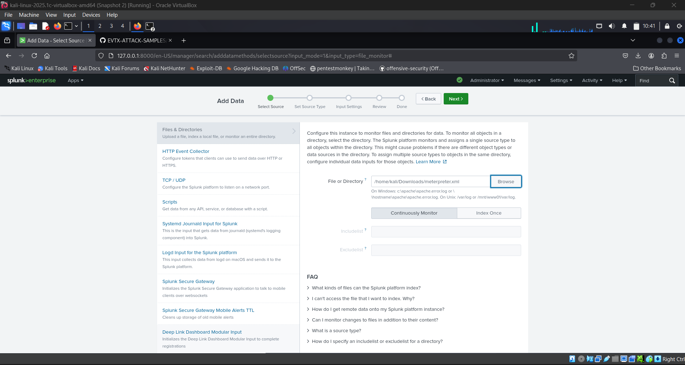

## 🧪 Ingesting Test Files into Splunk (File Monitor Input)

You can ingest static or generated log files into Splunk using the **File Monitor Input**.  
This is useful for testing log analysis with `.evtx`, `.xml`, `.json`, `.log`, and other formats.

---

### ✅ Prerequisites

- Splunk Enterprise is installed and running
- Your test log file is copied to a known location  
  _Example_: `~/Downloads/meterpreter.xml`

---

### 🛠️ Step 1: Move Your File to a Monitored Directory (Optional but Recommended)

Organizing test files under a consistent path like `/opt/splunk/test-logs/` is a good practice.

```bash
sudo mkdir -p /opt/splunk/test-logs/
sudo cp ~/Downloads/meterpreter.xml /opt/splunk/test-logs/
```

### 🧩 Step 2: Add File Input via Splunk Web

1. Go to:  
   `Settings → Data Inputs → Files & Directories`

2. Click **“New Local File & Directory”**

3. Fill in the following details:

   | Field              | Value                                                |
   |--------------------|------------------------------------------------------|
   | **File or directory** | `/opt/splunk/test-logs/meterpreter.xml`         |
   | **Input type**        | `File`                                           |
   | **Host**              | `Manual` or `Automatic`                          |
   | **Index**             | `test` or any preferred index (e.g., `threats`) |
   | **Sourcetype**        | `xml`, `json`, or custom (e.g., `evtx:attack`)  |

4. Click **Next → Review → Finish**




---

### 🧠 Tips

- Use meaningful **sourcetypes** for test data:  
  _Examples:_ `evtx:mimikatz`, `json:alerts`, `log:reverse_shell`

- You can ingest **multiple test files** by selecting a **directory** instead of a single file.

- Confirm ingestion using a search like:

  ```spl
  index=test sourcetype=xml
  ```

---
