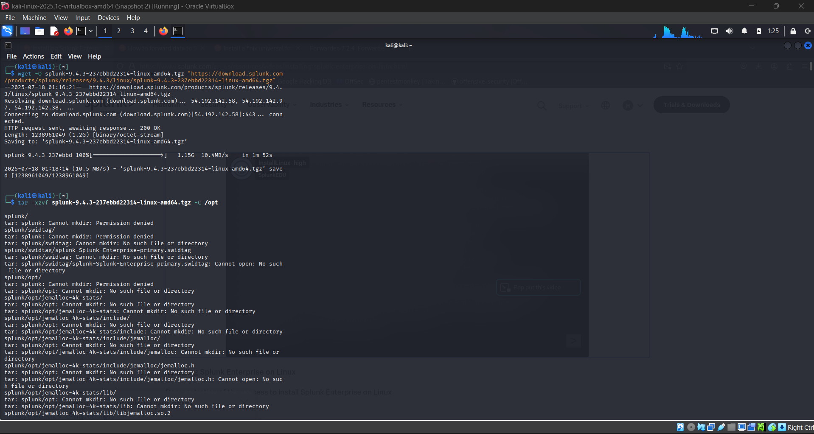
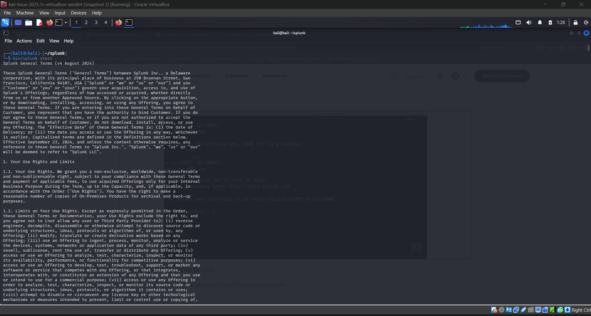
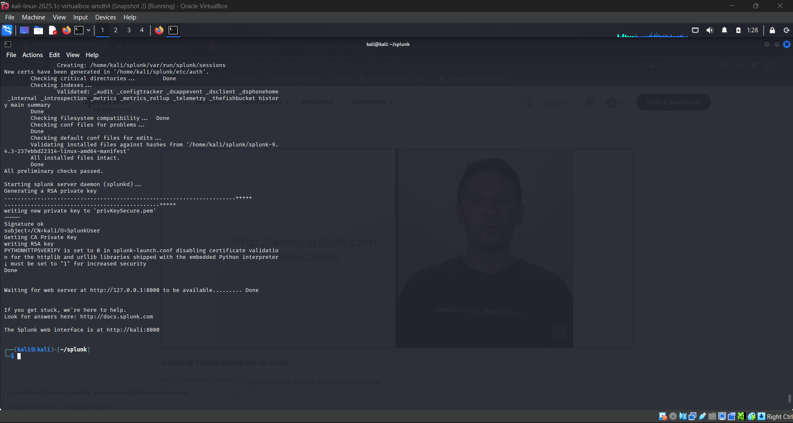
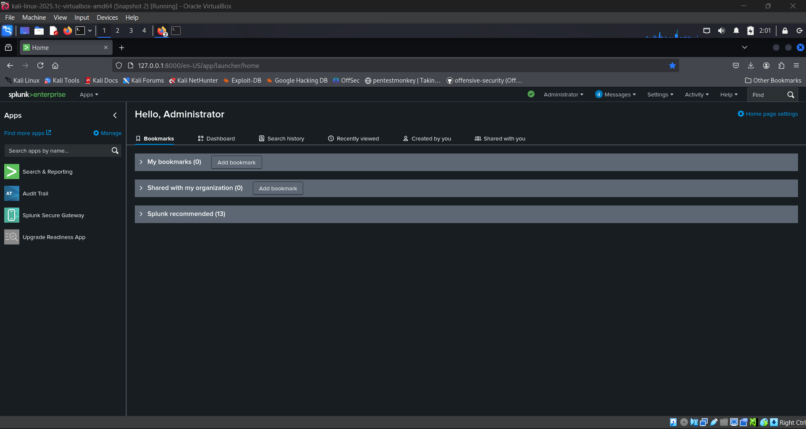

# ⚙️ Splunk Enterprise Setup on Kali Linux

This guide provides step-by-step instructions to install and configure **Splunk Enterprise** on **Kali Linux**, used as the core SIEM in the Splunk SIEM Project.

---

## 📥 Step 1: Download Splunk Enterprise

1. Visit the [Splunk Downloads Page](https://www.splunk.com/en_us/download/splunk-enterprise.html)
2. Choose:
   - **Linux (64-bit)**
   - File format: `.deb` (for Debian-based systems like Kali)
3. Or use `wget` to download directly:

```bash
wget -O splunk-latest.deb 'https://download.splunk.com/products/splunk/releases/9.2.0/linux/splunk-9.2.0-xxxxxxx-linux-2.6-amd64.deb'
```

---

## 🛠️ Step 2: Install Splunk

- Install the `.deb` file 

```bash
sudo dpkg -i splunk-latest.deb
```

- Fix dependencies if needed:

```bash
sudo apt --fix-broken install
```



---

## 🚀 Step 3: Start and Enable Splunk

- Accept the license and set admin credentials:

```bash
sudo /opt/splunk/bin/splunk start --accept-license
```





- Enable Splunk to start at boot:

```bash
sudo /opt/splunk/bin/splunk enable boot-start
```

- Access the Web Interface at:

Default port: 8000
Login: admin / your configured password

```
http://<your-kali-ip>:8000
```



---

## 📦 Step 4: Configure Data Inputs

### ✅ Log Sources in This Project

- Wazuh logs from CSI Linux via Universal Forwarder

- Cowrie Honeypot logs via HTTP Event Collector (HEC)

- OPNsense firewall logs via UDP syslog (port 514)

- Local system logs via journald (/var/log)

- Windows Event Logs (.evtx) from Server 2008 using Wazuh Agent

See individual folders in the repo for configuration of each source.

### 📁 File & Directory Structure
Path --> Purpose
/opt/splunk -->	Main Splunk installation directory
/opt/splunk/etc/apps	--> Apps and add-ons (e.g., TA-Wazuh, TA-pfSense)
/opt/splunk/var/log/splunk	--> Splunk internal logs
/opt/splunk/etc/system/local/	--> Custom config files (inputs.conf, outputs.conf)

### 🔒 Optional: Firewall Rules

If accessing remotely, allow port 8000 (Web UI) and other inputs:

```bash
sudo ufw allow 8000/tcp
sudo ufw allow 514/udp
```

### 🧠 Tips

Use Splunk Add-ons for better parsing:
- TA-Wazuh
- TA-Cowrie
- TA-pfSense

Restart Splunk after major configuration changes:

```bash
sudo /opt/splunk/bin/splunk restart
```

### 🧪 Verification

Login to Web UI → Search & Reporting
Use a basic query to test log ingestion:

```spl
index=* | stats count by sourcetype
```

---
